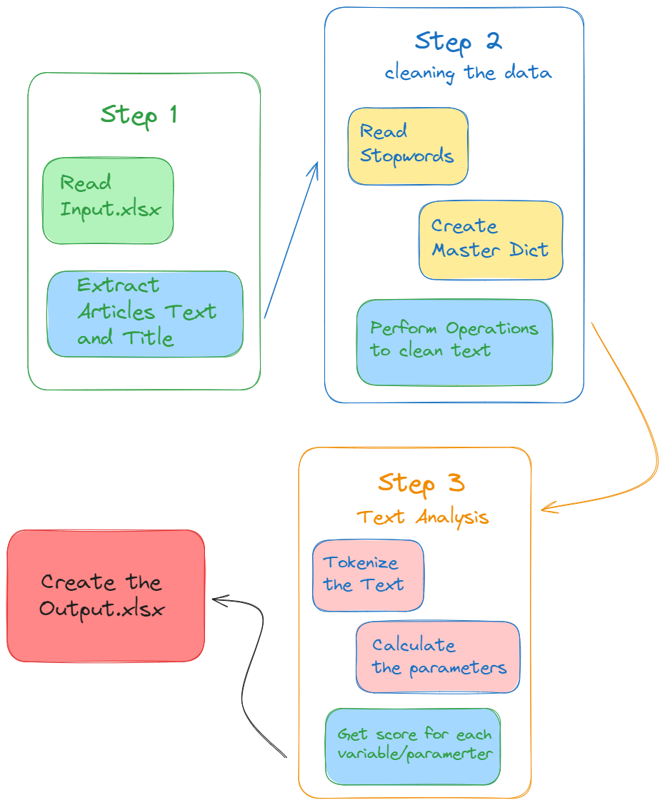

# Fullstack Dev Internship Assignment

### Roshan Singh (rosh.s568@gmail.com)
Assignment: https://drive.google.com/drive/folders/1ltdsXAS_zaZ3hI-q9eze_QCzHciyYAJY?usp=sharing

## Note
-  Broken Links
    * blackassign0036
    * blackassign0049
- The Output.xlsx file is already generated inside the project.
- You can generate a fresh output by: 
    * Deleting all the files inside articles folder & Output file to generate a fresh output
    ```bash
        rm articles/* && rm Output.xlsx
    ```

## Steps to Run generate Output
### 1. Installing Pre-requisities
```bash
pip install pandas nltk requests openpyxl bs4
or
pip3 install pandas nltk requests openpyxl bs4
```

### 1. Run the script
```python
python main.py
or
python3 main.py
```



This will run the script to do the following:
1. Extraction of links in the Input.xlsx file
2. Extraction of title and text of Articles from the links and storing them in text files in 'articles' folder
3. Getting Master Dictionary and Stopwords from the  'master-dict' & 'stopwords' directories
4. Performing Text Analysis on the extracted Articles
5. Generating the 'Output.xlsx' file.

